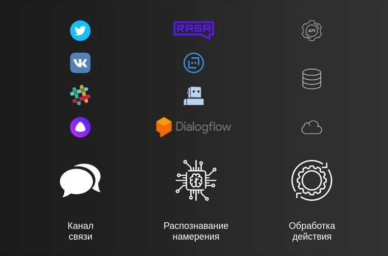
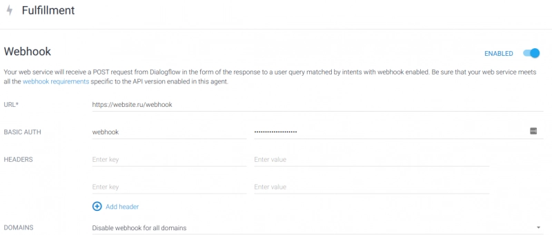

# 企业智能对话机器人搭建完全指南：从零到落地的实战经验

---

你可能早就听说过聊天机器人能让工作更轻松。但现实往往是：看了一堆教程还是不知道从哪儿下手，或者做出来的机器人只会回"你好"。

这篇文章会告诉你真正能用的方案——从选平台到写代码，从简单问答到复杂的会议室预订。我会分享在Selectel公司从技术写手到云解决方案工程师这一路上，实际搭建企业内部机器人的经验。不讲虚的，只讲能落地的东西。

---

## 聊天机器人到底能干什么

从2000年代开始，关于聊天机器人的新闻就没断过。但很多人对它的理解还停留在"客服自动回复"这个层面。

实际上，机器人的应用场景比你想的宽得多。它的核心能力是两个：**处理重复性对话**和**执行标准化任务**。人类做这些事会累会烦，但机器不会。更关键的是，它能做一些人力做不到的事——比如7×24小时监控社交媒体上的品牌提及。

我在Selectel的第一个机器人项目就是给市场部做的社交媒体监控。这个机器人会自动抓取VK、Twitter等平台上提到公司的评论，然后推送到Slack频道。听起来简单，但它能比市面上的IFTTT之类的工具更精准地过滤信息。

后来我们又做了两个机器人：一个是给HR部门用的内部助手，另一个是在SelectelTechDay技术大会上展示的客户服务demo。这两个机器人用了完全不同的技术栈，但底层逻辑是一样的。

## 机器人工作的三个核心环节

不管你用什么平台搭建，所有聊天机器人的工作流程都可以拆成三步：

**1. 接收和输出信息**  
这个环节决定了你的机器人在哪里"现身"。可能是Slack工作区，可能是VK私信，也可能是你自己网站上的聊天窗口。

**2. 理解用户意图**  
这是最关键的部分。用户说"天气怎么样"和"今天会下雨吗"，机器人得知道这俩问题本质上是一回事。这个过程叫"意图识别"（Intent Recognition）。

**3. 执行动作和返回结果**  
识别出意图后，机器人需要做点实事——可能是查询数据库，可能是调用第三方API。比如用户问天气，机器人就得去调用天气接口，拿到数据后再组织成人话发回去。

这三步看起来简单，但要做好有个大前提：**机器人得记住上下文**。如果用户先问"北京天气怎么样"，再问"明天呢"，机器人得知道这个"明天"指的是北京的明天，而不是傻乎乎地问"你想问哪个城市"。

还有个技术问题：怎么把机器人接入各种聊天平台？你可以自己写连接器（Connector），也可以用现成平台提供的。👉 [如果你想快速部署一个稳定的机器人服务器环境，推荐看看这个云服务方案](https://cp.gthost.com/en/join/72c7e6b2fc118929f9ede2978f008806)，特别适合需要高可用性的企业级应用。

## 选什么平台搭建

最简单的做法是写一堆if-else：如果用户说A，就回复B。但这种方式扩展性太差，新增一个场景就得改代码。

我们需要的是一个能"理解"人话、能管理对话流程、能执行复杂操作的系统。市面上主流的平台有这么几个：

- **DialogFlow**（Google家的）  
- **Wit.ai**（Facebook出品）  
- **Azure Bot Service**（微软的）  
- **Rasa Core**（开源方案）

选平台主要看三点：

**数据存在哪里**  
DialogFlow和Wit.ai是把你的对话数据发到他们服务器上处理。如果你的公司对数据安全要求高，这可能不太合适。Rasa Core和Azure的SDK可以让你把所有数据留在自己的服务器上。

**支持多少聊天渠道**  
DialogFlow自带一些常用的连接器（Slack、Telegram等），配置API密钥就能用。Wit.ai和Rasa需要你自己写连接器代码，不过通常不难。Azure介于两者之间——有现成的也能自己扩展。

**谁来维护机器人的知识库**  
如果你的机器人是纯代码实现的，那只有开发人员能修改。但很多时候，运营或客服团队才是最了解用户问题的人。所以最好选一个带可视化编辑界面的平台，让非技术人员也能添加和修改对话内容。

## 我们的选择：DialogFlow + 私有云

给Selectel内部做的聊天机器人"Tirex"，我们最后选了DialogFlow。主要原因：

1. 上手快，几分钟就能跑起来
2. 有现成的Slack连接器
3. 可视化编辑界面，HR同事也能自己加FAQ
4. 敏感操作（比如查数据库）可以放在我们自己的私有云里执行

这个机器人解决了公司的几个实际痛点：

- **新员工常见问题轰炸**："图书馆怎么借书？""午饭去哪吃？"这类问题每天要回答十几遍
- **会议室预订混乱**：经常撞档期，或者预订了不用浪费资源
- **内部文档难找**：知识库里有几百份文档，人工搜索效率太低

## DialogFlow实战：从零搭建会议室预订机器人

先理清楚几个概念：

- **意图（Intent）**：用户想干什么。比如"预订会议室"就是一个意图
- **参数（Parameter）**：完成任务需要的信息。比如预订需要知道时间、时长、人数
- **训练短语（Training Phrase）**：用户可能怎么说。比如"帮我订个会议室""明天下午有空房间吗"
- **响应（Response）**：机器人该做什么。可能是直接回复文本，也可能是调用你的服务器执行操作

### 创建意图架构

我们要做一个会议室管理机器人，需要两个核心意图：

1. 查看现有预订
2. 新建预订

以"新建预订"为例，用户可能这么说：

- "帮我订今天晚上11点15分，半小时"
- "嗨，麻烦给我订11月8号下午3点到4点的会议室"
- "订个房间"
- "我需要会议室"

训练短语越多越好。DialogFlow会从这些例子中学习，识别出新的表达方式。

### 参数提取和多轮对话

机器人的工作流程是这样的：

1. 用户发来一句话："帮我订会议室"
2. DialogFlow判断这是"预订会议室"意图
3. 检查必要参数（时间、时长）是否齐全。缺的话就追问："你想什么时候用？"
4. 收集完所有参数后，向我们的服务器发送请求
5. 服务器执行预订操作，返回结果
6. 机器人把结果用人话告诉用户

实际效果是这样的：

### 连接你的服务器

简单的问答可以直接在DialogFlow里配置答案。但复杂操作（查数据库、调API）需要你自己的服务器来处理。

在DialogFlow的Fulfillment设置里，填入你的服务器地址（Webhook URL）：

服务器端的代码很简单。这里有个[快速上手的代码示例](https://gist.github.com/Gaikanomer9/392cbdd14f213a052d765a248a844854)：

你的服务器接收DialogFlow发来的JSON数据，处理完后返回响应文本。就这么简单。

## 如果你想完全自主控制：Rasa方案

DialogFlow虽然好用,但数据要经过Google的服务器。如果你的公司对数据主权有严格要求，可以考虑用开源方案[Rasa](https://rasa.com/)。

Rasa包含两个核心组件：

- **Rasa NLU**：负责理解用户说了什么（意图识别、实体提取）
- **Rasa Core**：负责管理对话流程（下一步该说什么、该做什么）

我准备了一个[Rasa的Docker快速启动模板](https://github.com/Gaikanomer9/rasa-docker-bot)，你可以clone下来试试。完整的Rasa教程如果大家有兴趣的话，我会另写一篇详细说明。

## 值不值得做这件事

聊天机器人不是万能药。它解决不了产品本身的问题，也代替不了人的同理心。但如果你的业务里有大量重复性对话、标准化流程、7×24小时的响应需求，机器人确实能显著提升效率。

现在的工具已经把门槛降得很低了。DialogFlow这种平台让你不用懂机器学习也能做出能用的机器人。开源方案像Rasa则给了你完全的控制权。无论选哪个，关键是想清楚你要解决什么问题。

如果你已经在用聊天机器人，欢迎在评论区聊聊实际效果——无论是成功经验还是踩过的坑，都是宝贵的参考。

---

现代企业的自动化需求越来越高，聊天机器人只是其中一环。无论你是想搭建内部工具还是对外服务，选对技术栈和基础设施都很关键。👉 [这里有个适合部署企业级应用的云服务方案](https://cp.gthost.com/en/join/72c7e6b2fc118929f9ede2978f008806),特别适合需要高稳定性和数据安全的场景。
